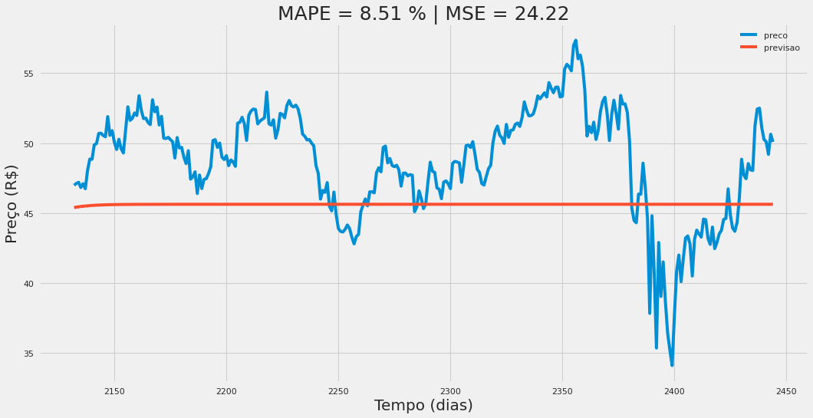
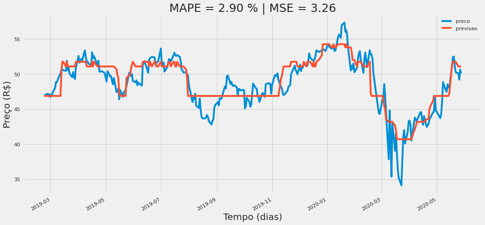
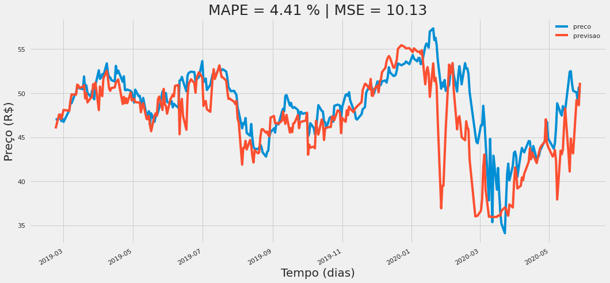
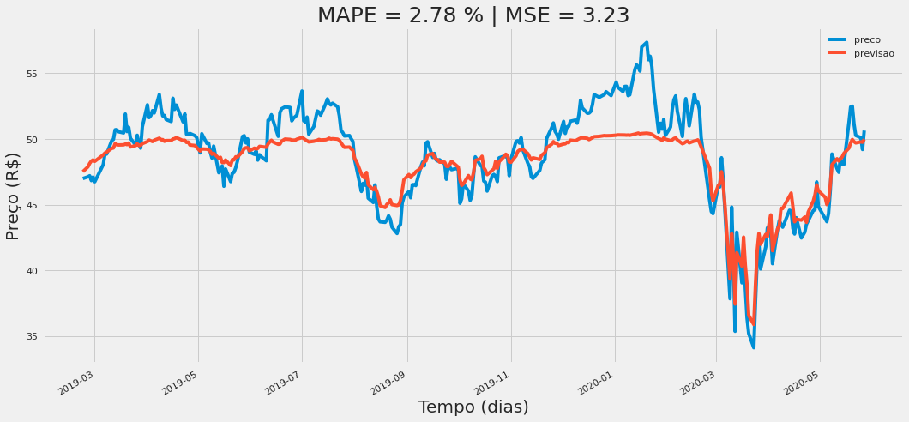

# Trabalho de Conclusão de Curso

## Título
Análise Comparativa de Ténicas para a Previsão de Séries Temporais no Contexto de Mercados Financeiros

## Publicação
[Biblioteca UFSC](https://repositorio.ufsc.br/handle/123456789/223843)

## Objetivos

### Geral
Comparar as principais técnicas de predição para ST no contexto de mercado financeiro.

### Específicos
1. Fazer uma análise qualitativa sobre o estado da arte sobre na predição de ST e teorias de previsão nos mercados financeiros;  
2. Definir os processos de obtenção e preparação dos dados;
3. Definir os algoritmos mais adequados a serem implementados visando as áreas econométrica, AM e aprendizado profundo;
4. Criar modelagens computacionais para as técnicas escolhidas no item anterior;
5. Treinar os modelos escolhidos;
6. Fazer uma análise comparativa dos resultados dos preditores; 
7. Desenvolver um repositório e disponibilizar na internet, de maneira a tornar todos os resultados desta pesquisa amplamente reproduzíveis.

### Resultados das Modelagens

#### AR

 

#### ARIMA

 

#### SARIMA

 

#### Floresta Aleatória

 

#### SVR

 

#### LSTM

 

## Referências
Patel, J., Shah, S., Thakkar, P., & Kotecha, K. (2015) Predicting stock and stock price index movement using trend deterministic data preparation and machine learn- ing techniques. Expert Systems with Applications, 42, 259-268. Disponível em: https://www.sciencedirect.com/science/article/pii/S0957417414004473

Sampaio e Mancini, 2007.  Estudos De Revisão Sistemática: Um Guia Para Síntese Criteriosa Da Evidência Científica. Universidade Federal de Minas Gerais, Belo Horizonte, MG. Disponível em : https://www.scielo.br/pdf/rbfis/v11n1/12.pdf  

Lo, Andrew W. (2004) The Adaptive Markets Hypothesis: Market Efficiency from an  Evolutionary Perspective. Journal of Portfolio Management, Forthcoming. Disponível em: https://papers.ssrn.com/sol3/papers.cfm?abstract_id=602222

Kaushik, Manav, e A. K. Giri. (2020), Forecasting Foreign Exchange Rate: A Multivariate Comparative Analysis between Traditional Econometric, Contemporary Machine Learning & Deep Learning Techniques. arXiv preprint arXiv:2002.10247. Disponível em: https://arxiv.org/abs/2002.10247

Luger, George F. (2013), Inteligência Artificial. 6 ed. São Paulo, Brasil. Pearson Education

BUSSAB, Wilton de Oliveira e MORETTIN, Pedro Alberto (2010), Estatística básica. 6 ed. São Paulo, Brasil. Editora Saraiva

Cao, L., Tay, F. (2001) Financial Forecasting Using Support Vector Machines. Neural Comput & Applic 10, 184–192. Disponível em: https://link.springer.com/article/10.1007/s005210170010

Parmezan, Antonio Rafael Sabino. Predição de séries temporais por similaridade. 2016. Dissertação (Mestrado em Ciências de Computação e Matemática Computacional) - Instituto de Ciências Matemáticas e de Computação, Universidade de São Paulo, São Carlos, 2016. doi:10.11606/D.55.2016. tde-21112016-150659.  Disponível em: https://www.teses.usp.br/teses/disponiveis/55/55134/tde-21112016-150659/pt-br.php

BOX, G. E. P.; JENKINS, G. M.; REINSEL, G. C.; LJUNG, G. M. Time series analysis: Forecasting and control. 5. ed. New Jersey, United States of America: Wiley, 2015. (Wiley Series in Probability and Statistics).

Junior, Salomon and Pamplona. ARIMA: An Applied Time Series Forecasting Model for the Bovespa Stock Index. Applied Mathematics, 2014, 5, 3383-3391 Published Online December 2014 in SciRes. Disponível em:  https://www.researchgate.net/publication/275214476

Kaastra, M. Boyd. Designing a neural network for forecasting financial and economic time series. Neurocomputing, 10 (3) (1996), pp. 215-236. 1996 Disponível em: https://www.sciencedirect.com/science/article/pii/0925231295000399/pdf?md5=85cce437dd80a9cc55ebaa8a43455327&pid=1-s2.0-0925231295000399-main.pdf  

Daniel, Fabrice. Financial Time Series Data Processing for Machine Learning. arXiv preprint arXiv:1907.03010, 2019 - arxiv.org. 2019. Disponível em: https://arxiv.org/pdf/1907.03010.pdf

Sergio, Anderson Tenório. Seleção dinâmica de combinadores de previsão de séries temporais. Dissertação de Doutorado em Ciências de Computação - Centro de Informática, Universidade Federal de Pernambuco, Recife, 2017. Disponível em: https://repositorio.ufpe.br/bitstream/123456789/25449/1/TESE%20Anderson%20Ten%C3%B3rio%20Sergio.pdf 

Cowpertwait, P. S. P.; Metcalfe, A. V. Introductory time series with R. Springer Science & Business Media, 2009.

Vapnik, V. N.  An overview of statistical learning theory. IEEE Transactions on Neural Networks, 10, 988–999 1999. Disponível em : https://ieeexplore.ieee.org/document/788640 

PYTHON SOFTWARE FOUNDATION. Python Language Site: Documentation, 2021. Página de documentação. Disponível em: https://www.python.org/doc/

GIL, A. C. Como elaborar projetos de pesquisa, 2010. 4 ed. São Paulo, Brasil. Editora Atlas.

Bueno, R. L. Econometria de Séries Temporais, 2011. 2 ed. São Paulo, Brasil. Editora Cengage Learning.

---

 

 

